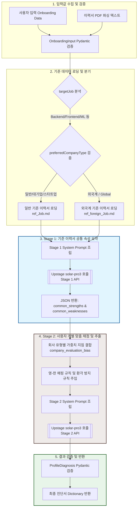

# 에이전트 1 (Profile Diagnosis Agent) 상세 명세서 및 가이드

본 문서는 **CareerMate** 프로젝트의 핵심 진단 엔진인 **에이전트 1 (프로필 진단 에이전트)**의 아키텍처, 기능 명세, API 규격, 그리고 프롬프트 설계 사상을 상세하게 기록한 개발자 가이드입니다.

---

## 1. 에이전트 요약 (Agent Summary)

**Profile Diagnosis Agent(에이전트 1)**는 온보딩 과정에서 입력한 정량·정성적 정보와 업로드한 이력서 텍스트를 종합 분석하여, 목표 직무의 **"100점짜리 기준 이력서(Benchmark Resume)"**와 객관적으로 대조하는 정밀 진단 AI 에이전트입니다.

* **핵심 목적**: 목표하는 IT 직무의 모범 표준 스펙 대비 사용자가 가진 강점과 약점을 파악하고, 실무 관점에서 현재 보유 중인 유효 기술 스택(`owned_skills`)을 객관적으로 정제하여 에이전트 2 및 에이전트 3(로드맵 설계)의 기초 데이터 역할을 수행합니다.
* **추론 모델**: Upstage `solar-pro3` (OpenAI 호환 API 활용)
* **설계 특징**: 1단계(직무 표준 추출)와 2단계(사용자 프로필 채점 및 스택 정제)로 구성된 **2단계 API 체이닝(Two-Stage API Chaining)** 모델을 채택하여 정밀도를 극대화했습니다.

---

## 2. 제공 기능 (Key Features)

### A. 직무별 기준 이력서(Benchmark) 동적 로딩
* 사용자의 목표 직무(`targetJob`)에 맞춰 사전에 정의된 고품질의 100점짜리 기준 이력서 데이터를 동적으로 로딩합니다.
* 지원 직무: Backend, Frontend, AI Product, Data, Machine Learning (ML), DevOps / Infra 등.

### B. 희망 회사 유형별 가중치 평가 (Evaluation Bias)
사용자가 선호하는 기업 유형에 따라 가중치 잣대를 동적으로 다르게 적용하여 진단합니다.
* **대기업/중견기업**: CS 기초 지식(자료구조, 알고리즘, OS, 네트워크, 데이터베이스), 소프트웨어 공학 표준 원칙, 테스트 커버리지, 대규모 트래픽 분산 처리 및 확장성(Scalability) 역량을 무겁게 평가합니다.
* **스타트업**: 빠른 프로토타이핑 능력, 주도적 기능 배포 및 오너십, 최신 트렌디한 기술 스택 연동(FastAPI, Docker, Next.js 등), 린(Lean) 개발 방식 및 사용자 피드백 반영 역량을 우선 평가합니다.
* **외국계/글로벌 기업**: 글로벌 협업 경험, 영문 문서화 및 커뮤니케이션 능력, 오픈소스 기여 경험, 개발 자율성(Autonomy), Clean Code 및 TDD 방법론 준수 여부를 집중적으로 진단합니다.

### C. 외국계 타겟 글로벌 기준 이력서 분기 로직
* 사용자가 희망 회사 유형으로 `외국계` 혹은 `Global`을 선택할 경우, 영문 이력서 표준 스펙을 반영하여 작성된 별도의 글로벌 기준 이력서 파일(`ref_foreign_[Job].md`)을 로딩하여 영미권/글로벌 테크 기업 스펙에 걸맞은 강도 높은 기준을 제공합니다.

### D. 영-한 크로스-링구얼 의미 매핑 (Cross-Lingual Semantic Mapping)
* 글로벌 기준 이력서(영어)와 사용자 이력서(한국어)의 언어 불일치로 인해 강점이 약점으로 오판되는 현상을 방지합니다.
* 예: 기준서의 `Test-Driven Development (TDD)`와 사용자의 `테스트 코드 작성`, `TDD 구현`을 동일한 기술 스택으로 매핑하여 오진을 차단합니다.

### E. 팩트 기반 기술 스택 추출 및 환각 방지 (Strict Fact-based Extraction)
* 사용자가 명시하지 않은 프로젝트, 자격증, 기술 스택을 AI가 멋대로 창작하거나 과대 추론하는 환각(Hallucination)을 강력하게 차단합니다.
* 이력서 및 온보딩 정보에 명시적으로 사용 내역이 존재하는 언어, 프레임워크, 라이브러리, 데이터베이스, 인프라 도구에 한해서만 `owned_skills` 목록에 적재합니다.

---

## 3. Input & Output 데이터 정의 (Interface Schema)

### A. 입력 값 (Input Parameters)
모든 입력 값은 에이전트 호출 시 내부적으로 Pydantic 모델 `OnboardingInput`을 거쳐 정합성 검증이 수행됩니다.

| 변수명 | 데이터 타입 | 필수 여부 | 설명 | 예시 |
| :--- | :--- | :---: | :--- | :--- |
| `major` | `str` | 필수 | 사용자의 대학 전공 및 학년 정보 | `"컴퓨터공학과"` |
| `currentStatus` | `str` | 필수 | 현재 구직 상태 혹은 신분 | `"대학 졸업생"`, `"학생 (재학 중)"` |
| `interests` | `list[str]` | 필수 | 관심 기술 분야 리스트 | `["Backend", "Database"]` |
| `targetJob` | `str` | 필수 | 목표로 하는 구체적 IT 직무 | `"Backend Engineer"`, `"AI Product Engineer"` |
| `preferredCompanyType`| `str` | 필수 | 선호하는 기업 유형 (대기업/스타트업/외국계) | `"대기업"`, `"스타트업"`, `"외국계"` |
| `availableTime` | `str` | 필수 | 주당 학습 또는 취업 준비 가용 시간 | `"20시간 이상"` |
| `concerns` | `list[str]` | 필수 | 현재 구직자가 가지고 있는 취업 고민 리스트 | `["대용량 트래픽 경험 부족", "CS 면접 대비 걱정"]`|
| `resumeText` | `str` | 선택 | 이력서 PDF 파일 등에서 파싱하여 추출한 원문 텍스트 | `"# 김민수 | 신입 개발자 ... (이력서 전문)"` |

### B. 반환 값 (Output JSON Dictionary)
최종 아웃풋은 Pydantic 모델 `ProfileDiagnosis` 검증을 거친 후, 아래의 5가지 핵심 키를 갖는 파이썬 `dict` 형식으로 반환됩니다.

| 필드명 | 데이터 타입 | 설명 |
| :--- | :--- | :--- |
| `summary` | `str` | 전공, 이력서 스펙, 직무 일치도 및 고민을 종합적으로 고려하여 취업 현주소를 2-3문장으로 요약한 정성 진단서 |
| `strengths` | `list[str]` | 기준 이력서와 비교했을 때 사용자가 충족하는 상대적 강점 리스트 (명사형, 25자 이내) |
| `weaknesses` | `list[str]` | 기준 이력서 대비 사용자가 반드시 보완해야 할 기술적/경험적 약점 리스트 (명사형, 25자 이내) |
| `owned_skills` | `list[str]` | 이력서 텍스트와 온보딩 정보에서 순수 팩트 기반으로 추출된 사용자의 보유 기술 스택 목록 |
| `evidence` | `dict[str, str]` | `strengths` 및 `weaknesses`에 나열된 각 진단 항목들의 판단 근거가 된 입력 팩트(원본 텍스트 일부) 매핑 정보 |

---

## 4. Flow Chart (동작 메커니즘 흐름도)

에이전트 1의 입력 수신부터 2단계 API 체이닝을 거쳐 최종 결과를 반환하기까지의 전체 아키텍처 흐름은 다음과 같습니다.

---

## 5. 프롬프트 핵심 내용 (Prompting Philosophy)

### Stage 1: 기준 이력서 공통 역량 분석 (`SYSTEM_PROMPT_STAGE1`)
* **역할 규정**: 커리어메이트 수석 테크 리크루터 및 AI 벤치마크 분석가.
* **추출 원칙**: 기준 이력서들에 명시된 기술, 도구, 방법론만 드라이하게 추출하며, 주관적 상상을 금지합니다.
* **표현 제약**: 추출된 공통 강점/보완점 명칭은 25자 이하의 콤팩트한 명사형 구문으로 제한하여 직관성을 높입니다.

### Stage 2: 기준 대비 사용자 맞춤 분석 (`SYSTEM_PROMPT_STAGE2`)
* **역할 규정**: 커리어메이트 커리어 코치 및 프로필 진단가.
* **평가 편향(Bias) 가이드라인**: 대기업, 스타트업, 외국계 등 사용자가 선호하는 회사 유형의 지향점 정보를 명확히 주입하여 평가 필터 역할을 하도록 합니다.
* **크로스 링구얼 규칙**: 영어 기준서와 한국어 사용자 정보 사이의 의미적 유사성을 식별하는 유연성을 제공합니다.
* **환각 방지 룰**: `owned_skills` 추출 시 이력서에 없는 기술 스택을 추가하는 동작을 엄밀하게 통제하고, 근거 자료(`evidence`)와 일대일 매핑이 성립되도록 강제하여 신뢰도 높은 정성 보고서를 완성합니다.
